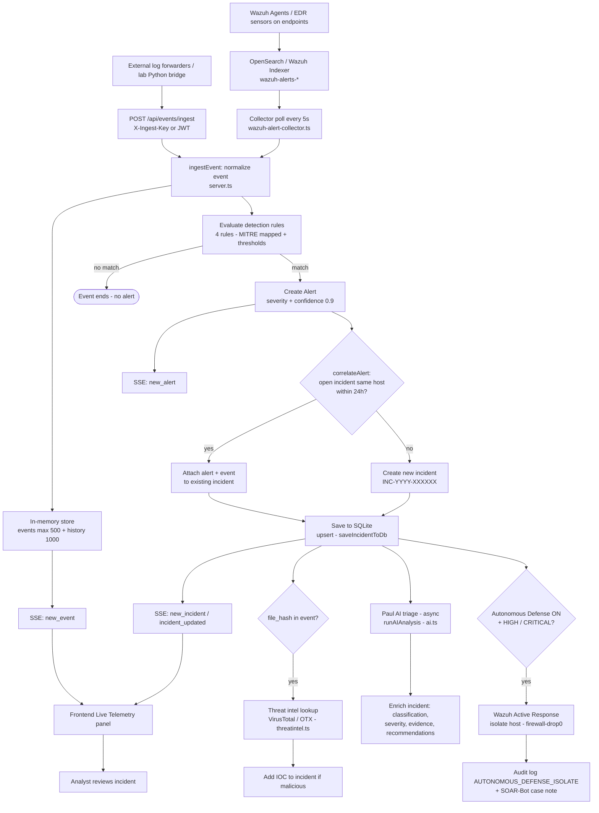
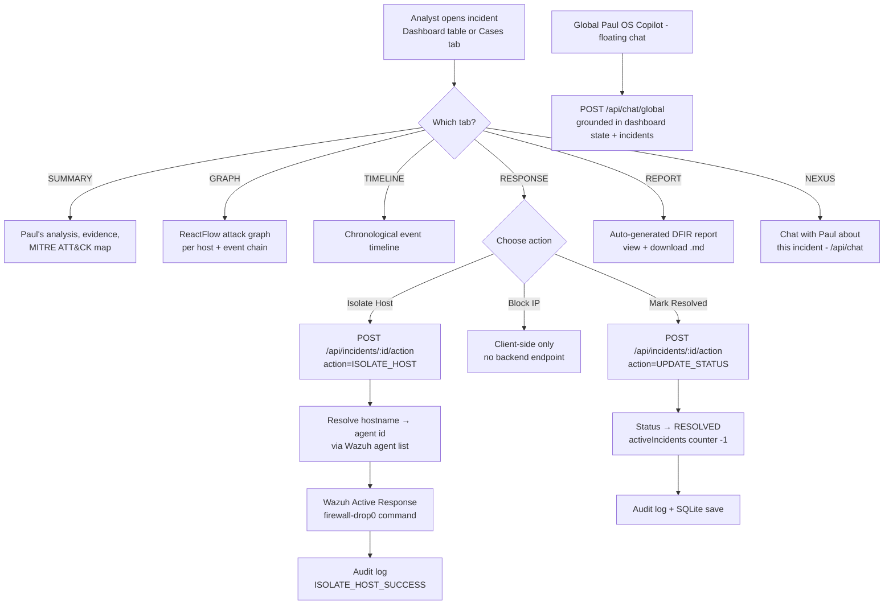
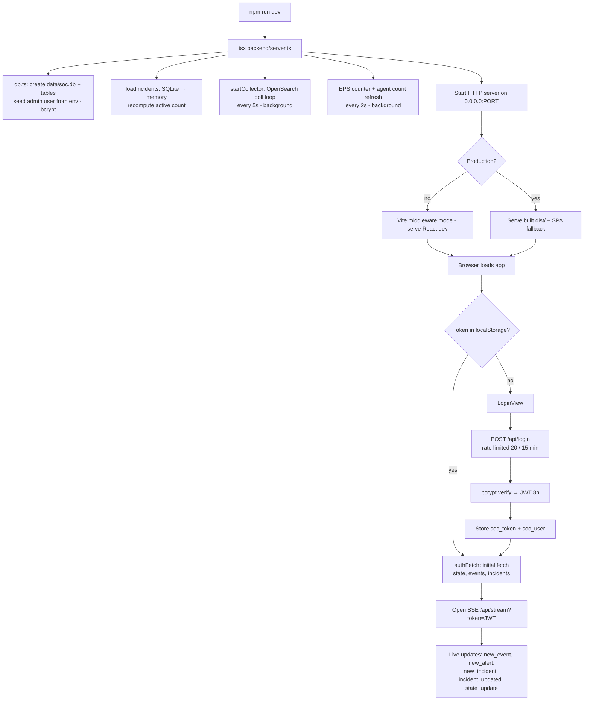

# BlackWhip SentinelX — Workflow Diagrams

All flows below are derived from the actual code (commit `a54849f`). Each diagram is in **Mermaid** (renders on GitHub / any Mermaid viewer) and the core flow is repeated in **plain-text ASCII** so it's readable anywhere.

---

## 1. Core Flow — Telemetry → Detection → Incident (end-to-end)



### Same flow in plain text (ASCII)

```
 ┌──────────────┐   ┌──────────────────────────────┐
 │ Wazuh Agents │   │ External forwarders / lab    │
 │  / EDR       │   │ Python bridge                 │
 └──────┬───────┘   └──────────────┬───────────────┘
        │                          │
        ▼                          ▼
 ┌──────────────────┐    ┌──────────────────────────┐
 │ OpenSearch       │    │ POST /api/events/ingest  │
 │ wazuh-alerts-*   │    │ (X-Ingest-Key or JWT)    │
 └────────┬─────────┘    └────────────┬─────────────┘
          │ poll every 5s             │
          ▼                           ▼
 ┌───────────────────────────────────────────────────┐
 │ ingestEvent()  →  normalize event (server.ts)     │
 └──────┬──────────────────────┬─────────────────────┘
        │                      │
        ▼                      ▼
 ┌───────────────┐    ┌─────────────────────────────┐
 │ In-memory     │    │ evaluateRules()             │
 │ events (500)  │    │ 4 rules, MITRE, thresholds  │
 └──────┬────────┘    └──────────┬──────────────────┘
        │                        │
        ▼                        │ match
 ┌───────────────┐               ▼
 │ SSE new_event │     ┌─────────────────────┐
 │ → Live panel  │     │ Create Alert        │
 └───────────────┘     │ (severity, conf .9)│
                       └──────────┬──────────┘
                                  ▼
                    ┌───────────────────────────┐
                    │ correlateAlert()          │
                    │ open incident, same host, │
                    │ < 24h ?                   │
                    └──────┬───────────┬────────┘
                           │ yes       │ no
                           ▼           ▼
                  ┌────────────┐ ┌──────────────────┐
                  │ Attach to  │ │ New incident     │
                  │ existing   │ │ INC-YYYY-XXXXXX  │
                  └─────┬──────┘ └────────┬─────────┘
                        │                 │
                        ▼                 ▼
                  ┌──────────────────────────────────┐
                  │ saveIncidentToDb()  (SQLite)     │
                  │ SSE: new_incident / updated      │
                  └──────┬───────────┬──────────┬────┘
                         │           │          │
              file_hash? │           │          │ Autonomous Defense
                         ▼           ▼          │ ON + HIGH/CRITICAL?
               ┌────────────────┐ ┌─────────────────┐      │
               │ VirusTotal /   │ │ Paul AI triage  │      ▼
               │ OTX lookup →   │ │ (async) → enrich │ ┌──────────────────┐
               │ add IOC if bad │ │ incident        │ │ Wazuh isolate    │
               └────────────────┘ └─────────────────┘ │ host + audit log │
                                                     └──────────────────┘
```

---

## 2. Analyst Incident-Handling Flow (manual response)



---

## 3. Startup / Boot Flow



---

## 4. Auth, API & Real-Time Update Flow

```mermaid
flowchart LR
    A[Login: POST /api/login] --> B[bcrypt.compare]
    B -->|fail| X[401 Invalid credentials<br/>anti-enumeration]
    B -->|ok| C[JWT signed - 8h expiry]
    C --> D[localStorage: soc_token + soc_user]
    D --> E[Every API call via authFetch<br/>Authorization: Bearer token]
    E --> F{Response 401 or 403?}
    F -->|yes| G[Wipe credentials + reload page]
    F -->|no| H[Use response]
    D --> T[POST /api/stream/token<br/>→ short-lived stream JWT (2 min)]
    T --> I[EventSource: /api/stream?token=STREAM_TOKEN<br/>auto-reconnects with fresh token on drop]
    I --> J[Server pushes: state_update every 2s,<br/>new_event / new_alert / new_incident<br/>/ incident_updated on demand]
    J --> K[React state updates → UI re-renders<br/>without refresh]
```

---

## 5. Where Each Step Lives (code map)

| Flow step | File | Function / endpoint |
|---|---|---|
| Event normalization | `backend/server.ts` | `ingestEvent()` |
| Event ingestion API | `backend/server.ts` | `POST /api/events/ingest` |
| OpenSearch polling | `backend/services/wazuh-alert-collector.ts` | `startCollector()` |
| Detection rules | `backend/rules.ts` | `detectionRules[]` |
| Rule evaluation | `backend/server.ts` | `evaluateRules()` |
| Alert → incident correlation | `backend/server.ts` | `correlateAlert()` |
| SQLite persistence | `backend/db.ts` + `server.ts` | `saveIncidentToDb()` |
| AI triage ("Paul") | `backend/ai.ts` | `runAIAnalysis()` |
| Incident / global chat | `backend/ai.ts` | `interrogateAI()` / `interrogateGlobalAI()` |
| Wazuh agents + isolation | `backend/wazuh.ts` | `getAgents()` / `isolateHost()` |
| Threat intel IOC lookup | `backend/threatintel.ts` | `lookupHash()` |
| OpenSearch search | `backend/opensearch.ts` | `searchEvents()` |
| Auth (login, JWT, RBAC) | `backend/server.ts` | `/api/login`, `requireAuth`, `requireAdmin` |
| SSE real-time stream | `backend/server.ts` | `GET /api/stream` |
| Frontend shell + SSE client | `frontend/src/App.tsx` | `useEffect` stream wiring |
| Login UI | `frontend/src/components/LoginView.tsx` + `lib/AuthProvider.tsx` | `signIn()` |
| Incident UI (6 tabs) | `frontend/src/components/IncidentView.tsx` | tabs: SUMMARY/GRAPH/TIMELINE/RESPONSE/REPORT/NEXUS |
| Attack graph | `frontend/src/components/AttackGraph.tsx` | ReactFlow graph |
| Sensors / agents UI | `frontend/src/sensors/SensorsDashboard.tsx` | `/api/wazuh/agents` |
| Threat hunting search | `frontend/src/components/ThreatHunting.tsx` | `/api/events/search` |

---

## 6. Flow Notes (things the diagrams hide)

- **Real-time only (no simulation)**: the platform has no simulator and no simulation mode. All telemetry comes from two live sources — the OpenSearch collector (5s poll of `OPENSEARCH_ALERTS_INDEX`) and `POST /api/events/ingest` from external forwarders. `mode` is always `LIVE` and `telemetrySource` always `REAL`; the dashboard shows a "no events received" banner until a source is connected.
- **Alert aggregation**: repeated matches of the same rule on the same host within 5 minutes are merged into one alert (count bumped, events appended) instead of flooding the alerts list — the correlated incident keeps the full event timeline.
- **Structured logging**: the server emits JSON log lines (`level`, `msg`, context) tracing the whole pipeline — `event_ingested` → `rule_matched` → `alert_created`/`alert_aggregated` → `incident_created`/`incident_attached` → `ai_triage_*` / `soar_auto_isolate`. Set `LOG_LEVEL=debug` for per-event traces.
- **EPS metric**: events counted over 2s, divided by 2, broadcast via `state_update`.
- **Autonomous Defense** only triggers on rule severity HIGH/CRITICAL and isolates the host via Wazuh; everything is audited.
- **IOC enrichment** only happens when an event carries a `file_hash`.
- **Paul triage is async (non-blocking)** — the incident appears immediately; the analysis enriches it when Gemini responds (or a fallback analysis is used on failure).
- **Block IP** button in RESPONSE tab is frontend-only — no backend action exists.
